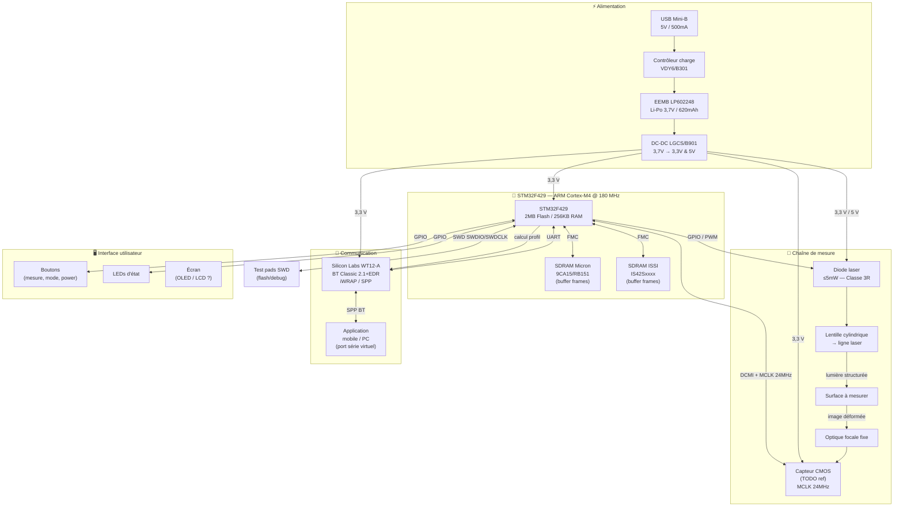

# Rétro-ingénierie — Schéma fonctionnel de principe

> Schéma mis à jour avec les références réelles identifiées lors du démontage (29/06/2026).

---

## Schéma de principe (Mermaid)

---

## Caractéristiques clés (à compléter le jour J)

| Paramètre | Valeur connue | À mesurer/confirmer |
|-----------|---------------|---------------------|
| Tension batterie | 3,7 V nominale | **EEMB LP602248 confirmé** |
| Capacité batterie | 620 mAh / 2,3 Wh | **Confirmé étiquette batterie** |
| MCU | STM32F429 ARM Cortex-M4 | **Confirmé marquage img#9** |
| Fréquence MCU | 180 MHz (max) | Via PLL interne depuis HSE |
| SDRAM | Micron 9CA15 + ISSI IS42S | **Confirmé img#9** |
| Oscillateur caméra | 24 MHz | **Confirmé img#5 — MCLK capteur** |
| Interface caméra → MCU | **DCMI** (STM32F429 natif) | Confirmé par MCU |
| Interface BT → MCU | **UART** (iWRAP WT12-A) | Confirmé par WT12-A |
| Classe laser | 3R, ≤5mW | **Confirmé étiquette produit** |
| Connecteur de charge | USB Mini-B 5V/500mA | **Confirmé étiquette + fiche** |
| Tension logique MCU | 3,3 V | À mesurer (probable pour STM32F429) |

---

## Interfaces bus disponibles (à cartographier)

| Bus | Rôle actuel | Disponibilité réemploi |
|-----|-------------|------------------------|
| UART (via USB/TTL) | Debug / Flash firmware | ✅ Accès probable via test pads |
| SWD / JTAG | Debug MCU bas niveau | ✅ Test pads à localiser |
| I²C | Écran, IMU éventuel | 🔍 À vérifier |
| SPI | Flash externe, caméra ? | 🔍 À vérifier |
| GPIO | Laser, boutons, LEDs | ✅ Identifiables par traces |
