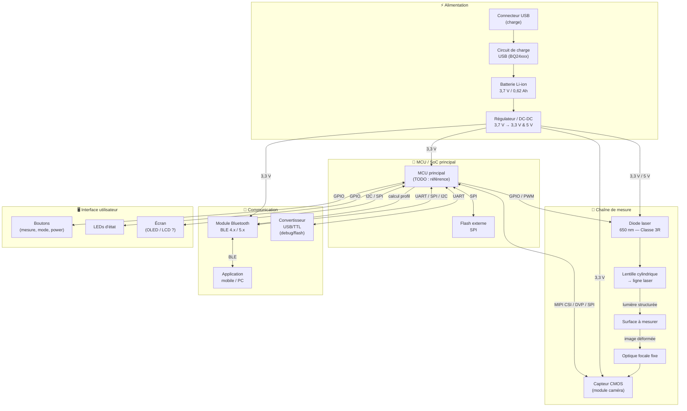

# Rétro-ingénierie — Schéma fonctionnel de principe

> Schéma basé sur la fonction documentée du produit. À affiner avec les références réelles le jour J.

---

## Schéma de principe (Mermaid)

---

## Caractéristiques clés (à compléter le jour J)

| Paramètre | Valeur connue | À mesurer/confirmer |
|-----------|---------------|---------------------|
| Tension batterie | 3,7 V nominale | Tension réelle à la charge |
| Capacité batterie | 0,62 Ah (620 mAh) | Marque/référence cellule |
| Tension logique MCU | 3,3 V (probable) | À mesurer sur le rail |
| Tension laser | ~3,3 V ou 5 V | À mesurer sur les pads driver |
| Interface caméra → MCU | DVP / MIPI CSI (probable) | Traces PCB ou marquage |
| Interface BT → MCU | UART ou SPI | À confirmer par traces |
| Classe laser | 3R (documenté) | Puissance optique max ? |
| Autonomie | ~500 mesures | À vérifier |

---

## Interfaces bus disponibles (à cartographier)

| Bus | Rôle actuel | Disponibilité réemploi |
|-----|-------------|------------------------|
| UART (via USB/TTL) | Debug / Flash firmware | ✅ Accès probable via test pads |
| SWD / JTAG | Debug MCU bas niveau | ✅ Test pads à localiser |
| I²C | Écran, IMU éventuel | 🔍 À vérifier |
| SPI | Flash externe, caméra ? | 🔍 À vérifier |
| GPIO | Laser, boutons, LEDs | ✅ Identifiables par traces |
