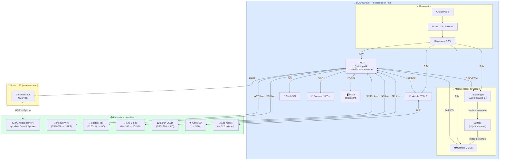

# Champ des possibles — Schéma fonctionnel « en l'état + extensions »

---

## Schéma complet (Mermaid)

---

## Légende

| Couleur | Signification |
|---------|--------------|
| 🔵 Bleu | Fonctions disponibles **en l'état** dans le SCANDIAG |
| 🟡 Jaune | Point de sortie **existant** (USB/TTL) utilisable sans modification |
| 🟢 Vert | **Extensions** potentielles (composants à ajouter si nécessaire) |

---

## Points de connexion prioritaires pour le POC

| Connexion | Type | Modification HW | Priorité |
|-----------|------|-----------------|----------|
| USB/TTL existant → PC | USB | Aucune | ⭐⭐⭐⭐⭐ |
| UART MCU → ESP8266 WiFi | Fil | Très faible | ⭐⭐⭐ |
| I²C MCU → TOF VL53L1X | Fils | Faible | ⭐⭐ |
| SPI → Carte SD | Fils | Faible | ⭐⭐ |
| BLE → App mobile | Aucune | Aucune | ⭐⭐⭐⭐ |
